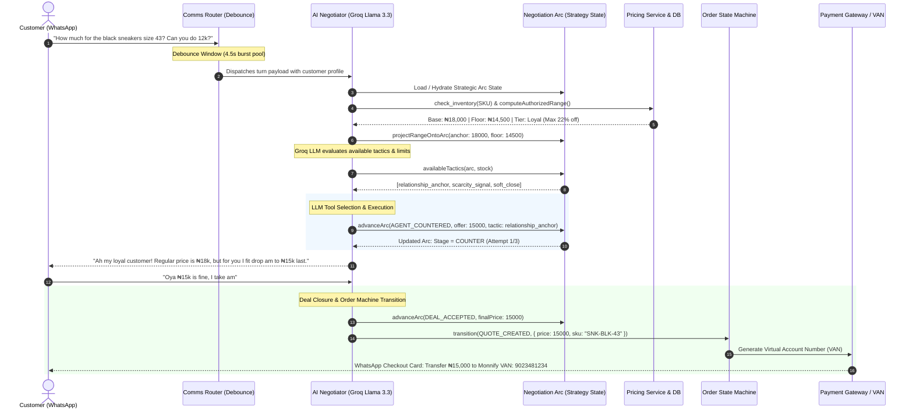
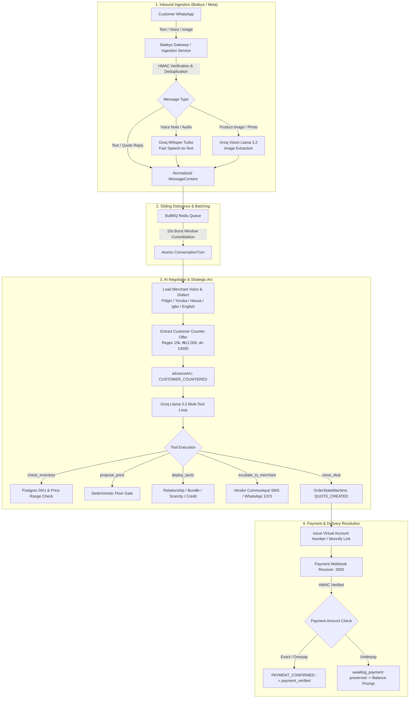
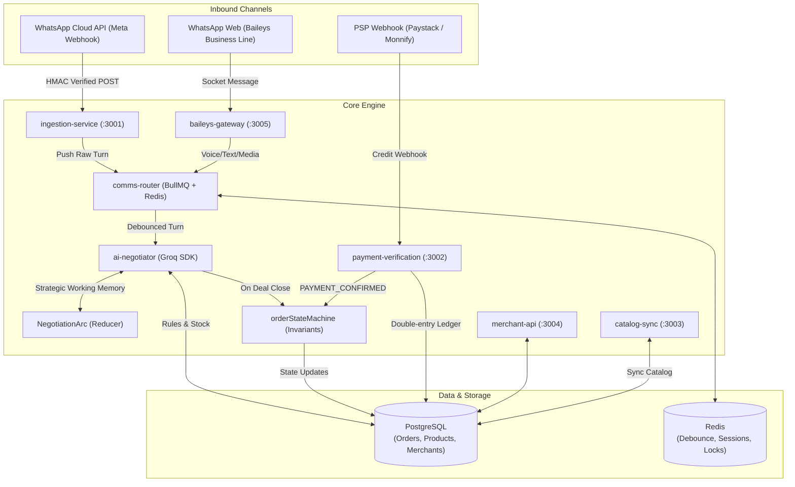
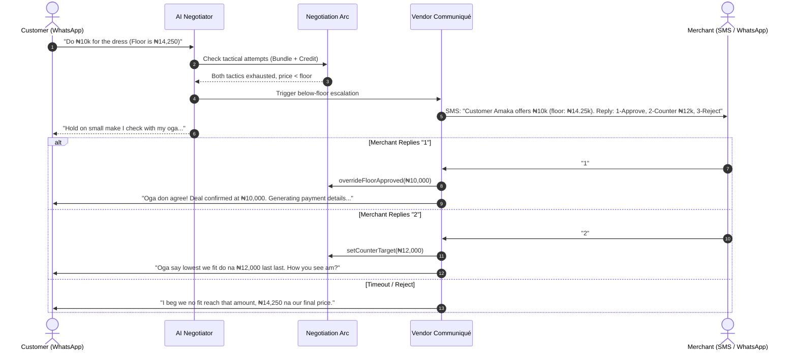
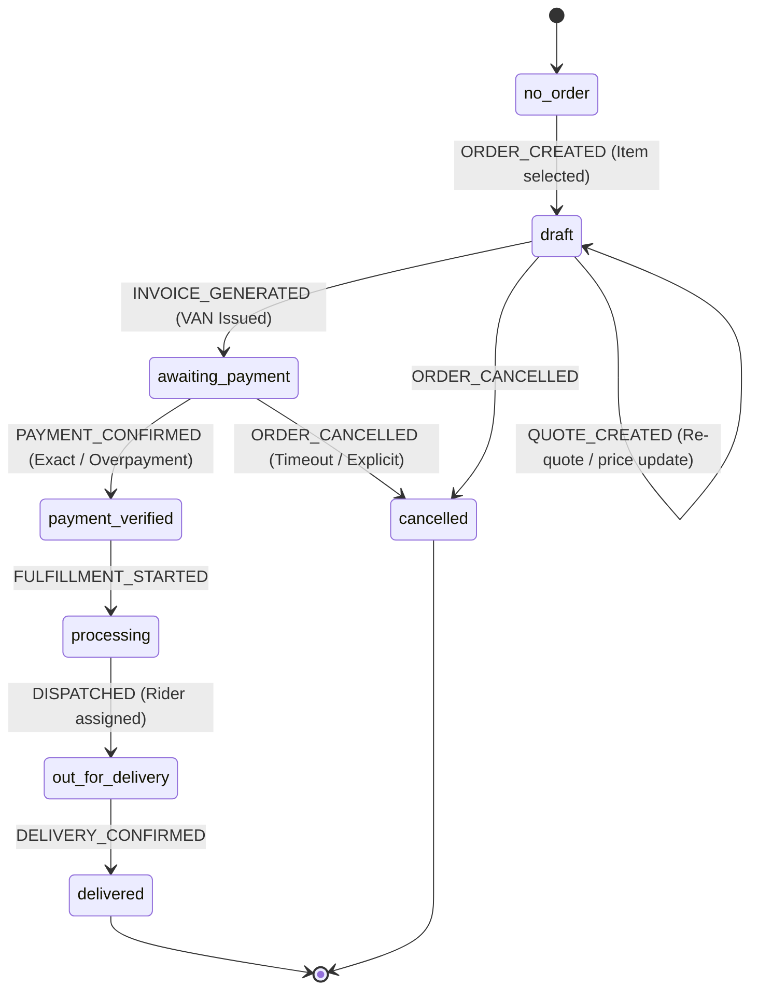
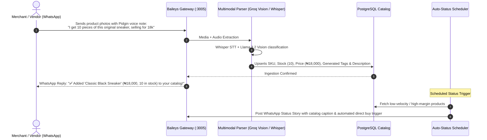

# ACE — Autonomous Commerce Engine

> ### **"Your business runs itself while you sleep."**
> **ACE Technologies Limited** · Nigerian C-Corp · Delaware flip option post-Series A

---

## The 30-Second Pitch

ACE is an invisible operating system for informal commerce. We turn WhatsApp chaos into autonomous businesses through radical AI automation. Merchants keep texting customers on WhatsApp — our AI handles inventory, payments, negotiations, logistics, and customer retention **completely in the background**.

**No new apps for customers. No manual work for merchants. Just autonomous growth.**

---

## The Problem

In Nigeria and across emerging markets, **$2.3 trillion** in commerce happens entirely on WhatsApp. ~480,000 merchants in Lagos alone manage 30–150 customer conversations daily through unstructured text, voice notes in Pidgin, and screenshots of bank transfers. These merchants are growing **40% YoY** but hit a hard ceiling at $50K annual revenue — they can't scale past their personal bandwidth.

| Current "Solution" | Why It Fails |
|-------------------|-------------|
| WhatsApp Business App | Zero state management, no payment integration, no inventory tracking |
| Respond.io / Zoko / Hilos | Routes chats to human agents — still requires merchants to check bank apps, call riders, update inventory manually |
| Shopify / WooCommerce | Requires customers to leave WhatsApp → **78% conversion drop** in emerging markets |
| Traditional ERP (Zoho, Odoo) | Desktop-oriented, requires structured data input — alien to merchants who think in conversations |

**The core insight:** The merchant's current system isn't broken — it's optimised for n=1. WhatsApp works perfectly for one customer. It catastrophically fails at 50 concurrent conversations. The merchant doesn't need a better inbox. They need an autonomous operating system that executes business logic while they sleep.

---

## The Paradigm Shift

| ❌ What We're NOT Building | ✅ What We ARE Building |
|---------------------------|------------------------|
| An AI chatbot that drafts responses for merchants to review | An autonomous OS that **executes** |
| A fancy CRM with "AI-powered insights" | An event-driven engine with no manual steps |
| Another unified inbox with message routing | Invisible back-office infrastructure |
| A tool requiring customers to change behaviour | Invisible layer on existing WhatsApp behaviour |

**The AI doesn't ask permission. It executes complex multi-step business logic and reports outcomes. The merchant's job shifts from operational execution to strategic exception management.**

---

## System Workings & Architecture

### 1. End-to-End Negotiation Flow Across the ACE Architecture



---

### 2. End-to-End Multimodal Pipeline & Execution Flow



---

### 3. Multi-Service Event Topology



---

### 4. Circuit Breaker & Vendor Escalation Flow



---

### 5. Deterministic Order State Machine Lifecycle



---

### 6. Vendor WhatsApp Inventory Ingestion & Auto-Status Posting



---

## Architectural Walkthrough by Feature

### 1. Regional Dialect & Cultural Persona (`Pidgin`, `English`, `Yoruba`, `Hausa`, `Igbo`)
- **Dialect Guidance**: [`dialectGuidance()`](file:///c:/Users/USER/Documents/Biblio/ace-whatsapp/core/ai-negotiator/src/agentLoop.ts#L329) injects culture-specific prompt framing based on the merchant's configuration:
  - **Pidgin**: Warm Nigerian Pidgin (*"abeg"*, *"o"*, *"sharp sharp"*, *"no wahala"*).
  - **Yoruba**: Yoruba-inflected English (*"ẹ kú iṣẹ́"*, *"ó dára"*).
  - **Igbo**: Igbo-inflected English (*"daalụ"*, *"ọ dị mma"*).
  - **Hausa**: Hausa-inflected English (*"sannu"*, *"madalla"*).
  - **English**: Clear, polite Nigerian English.
- **Trace Persistence**: The dialect is stamped onto both the in-memory [`NegotiationArc`](file:///c:/Users/USER/Documents/Biblio/ace-whatsapp/core/ai-negotiator/src/negotiationArc.ts) and the historical `negotiation_traces` database table.

### 2. Voice Notes (`.ogg` / `.opus` WhatsApp Audio)
- **Transcription**: In [`mediaProcessor.ts`](file:///c:/Users/USER/Documents/Biblio/ace-whatsapp/core/baileys-gateway/src/mediaProcessor.ts#L123), inbound audio streams are converted to in-memory files and transcribed with **Groq Whisper (`whisper-large-v3-turbo`)**.
- **Context Injection**: Transcriptions are passed to the agent as `[Voice note]: <transcript>`, instructing the model to respond naturally to the customer's speech without robotic meta-commentary.
- **Price Extraction**: Spoken price counter-offers (e.g. *"I get 12k for you"*) are parsed by [`extractCustomerPriceOffer`](file:///c:/Users/USER/Documents/Biblio/ace-whatsapp/core/ai-negotiator/src/agentLoop.ts#L252), triggering `advanceArc(CUSTOMER_COUNTERED)` automatically.

### 3. Image Processing & Auto-Status Posting
- **Vendor Inventory Push**: Vendor product photos sent to their line are parsed via **Groq Vision (`llama-3.2-11b-vision-preview`)** in [`inventoryParser.ts`](file:///c:/Users/USER/Documents/Biblio/ace-whatsapp/core/baileys-gateway/src/inventoryParser.ts), cataloged into PostgreSQL, and optionally broadcast to WhatsApp Status via [`postProductToStatus()`](file:///c:/Users/USER/Documents/Biblio/ace-whatsapp/core/baileys-gateway/src/statusPoster.ts#L30).
- **Customer Photo Queries**: Customer images sent during negotiation are base64-encoded and passed directly to the vision model to identify matching stock.

### 4. Payment Structures & Underpayment Protection
- **Virtual Account Numbers (VAN)**: [`issuePaymentLink`](file:///c:/Users/USER/Documents/Biblio/ace-whatsapp/core/ai-negotiator/src/tools.ts#L508) generates dynamic transfer cards with merchant bank details.
- **Webhook Reconciliation**: [`payment-verification/src/index.ts`](file:///c:/Users/USER/Documents/Biblio/ace-whatsapp/core/payment-verification/src/index.ts) listens on `:3002`, validates HMAC headers (`x-paystack-signature`, `x-ace-signature`), and checks amounts:
  - **Full Payment**: Transitions state to `payment_verified`, unlocks fulfillment, and sends receipt.
  - **Underpayment**: Locks state in `awaiting_payment`, prompts for the remaining deficit, and emits telemetry to `DataIntelligenceEngine`.

### 5. Burst Debouncing (ManyChat-Style Smoothness)
- [`debounce.ts`](file:///c:/Users/USER/Documents/Biblio/ace-whatsapp/core/comms-router/src/debounce.ts) consolidates rapid customer messages sent within 10 seconds into a single, cohesive `ConversationTurn`, preventing the AI from interrupting or double-responding.

---

## The Three-Layer Architecture

```
┌──────────────────────────────────────────────────────────────────┐
│  LAYER 3: ENTERPRISE INTELLIGENCE PLATFORM (B2B)                 │
│  AI Training Data · FMCG Market Pulse · ACE TrustScore API       │
│  The "Scale AI of Informal Commerce" — $16.5M ARR by Year 2      │
└───────────────────────────────┬──────────────────────────────────┘
                                │ (Refined data → enterprise buyers)
┌───────────────────────────────▼──────────────────────────────────┐
│  LAYER 2: AUTONOMOUS STATE ENGINE (Core IP)                       │
│  11 microservices: Rust core + Vercel AI SDK agent layer          │
│  Ingestion → Identity → AI Negotiator → State Machine →           │
│  Payment → Logistics → Supplier → Visual Context → Comms Router   │
│  Every interaction: data collected, refined, monetised            │
└───────────────────────────────┬──────────────────────────────────┘
                                │ (Raw commerce events)
┌───────────────────────────────▼──────────────────────────────────┐
│  LAYER 1: INTERFACE LAYER                                         │
│  Merchant: React Native app (exception dashboard)                 │
│  Customer: WhatsApp → PWA Trojan Horse → Global Buyer ID          │
│  Vendor Communiqué: SMS reply-code for merchant decisions         │
└──────────────────────────────────────────────────────────────────┘
```

---

## The Four Autonomous Workflows

ACE automates the **entire commercial lifecycle** — from first customer message to post-sale retention. The merchant interacts only with exceptions.

| Workflow | What ACE Does | Merchant Input |
|----------|--------------|---------------|
| **Order Fulfillment** | Customer texts → AI parses intent (Groq Llama 3.3) → AI Negotiator closes deal → virtual account issued → payment verified → rider dispatched → merchant notified | **Zero** |
| **Demand-Driven Restocking** | Inventory Oracle detects stockout (16hr lead) → pings supplier WhatsApp → negotiates price → margin analysis → drafts PO | **1 tap (8 seconds)** |
| **Customer Retention Engine** | Nightly analyser detects at-risk VIP → generates culturally-nuanced message → sends after 4hr hold if no merchant action | **Optional review** |
| **Multimodal Visual Resolution** | "That blue dress in your last reel" → CLIP / Llama 3.2 Vision embeddings → SKU resolved → price negotiated autonomously | **Zero** |

---

## The AI Negotiator — ACE's Most Differentiated Feature

ACE doesn't apply discounts. It **negotiates** — like a skilled market trader who knows the customer's full history, operates in their dialect, and closes deals autonomously within merchant-defined boundaries.

**The negotiation arc:** Anchor → Acknowledge → Counter → Close / Pivot / Escalate

**6 autonomous tactics:** Relationship Anchor · Bundle Pivot · Inventory-Verified Scarcity · Future Credit · Urgency Window · Sentiment-Aware Soft Close

**The anti-haggling concession guard:** Physical limit of max 3 agent offers per conversation thread before pricing locks permanently.

**The Rust / State Machine circuit breaker:** The AI is **physically prevented** from closing below the merchant's floor price. On below-floor requests: Bundle Pivot → Future Credit → Vendor Communiqué SMS to merchant.

**Every negotiation is a data asset:** `NegotiationTrace` logs price elasticity per SKU, per geography, per customer tier → sold to FMCG brands as market intelligence.

---

## The Vendor Communiqué System

ACE keeps merchants in control without requiring them to be at a dashboard.

```
Exception detected → Channel selected by urgency:
  > ₦50K order dispute  → AI voice call
  Pricing exception     → SMS: "Amaka wants dress at ₦12K (floor: ₦14,250). Reply 1-approve, 2-hold, 3-bundle"
  Restock approval      → SMS: "Red Ankara running out. Alhaji: ₦42K for 50yds (44% margin). Reply 1 to approve."
  Routine orders        → WhatsApp morning digest
  Stats                 → App push (weekly)
```

Merchants respond with a single digit from **any phone**. No app needed. Works on feature phones.

---

## Instant 1-Step Auto-Provisioning & Admin Portal

### 1. Zero-Config WhatsApp Line Onboarding
Any new Nigerian WhatsApp phone number can be provisioned in one seamless command or single button click in the Admin Portal without manual database seeding:
- **CLI**:
  ```bash
  npm run pair 2348012345678
  ```
- **Admin Portal UI**:
  ```bash
  npm run admin-portal
  ```
  Navigate to **WhatsApp Auto-Pairing** (`/vendor-status`), enter the phone number, and click **Auto-Provision & Pair**.
  - Automatically provisions PostgreSQL `merchants` and `vendors` records.
  - Seeds standard Nigerian pricing rules (floor margin, counter-offer step limits).
  - Configures cultural dialect voice (Pidgin, Yoruba, Igbo, Hausa, English).
  - Immediately requests and displays the **8-digit WhatsApp pairing code**.

### 2. Stateful "Note-to-Self" WhatsApp Business Mode
Merchants can operate and test their storefront directly on the same phone via WhatsApp's *"Message yourself"* chat:
- Send **`business`** to enter active business management mode.
- All product images, voice notes, pricing descriptions, and catalog queries sent in this state are parsed by the AI Vision & Whisper models and added to the store catalog.
- Send **`end-business`** to gracefully close the business management session.

---

## Technology Stack

| Layer | Stack |
|-------|-------|
| **Agent / AI orchestration** | TypeScript + **Groq SDK** (`llama-3.3-70b-versatile` & `llama-3.2-11b-vision-preview`) |
| **Core microservices** | Fastify, TypeScript, BullMQ, Redis, PostgreSQL |
| **WhatsApp Gateways** | Meta WhatsApp Cloud API (`ingestion-service`) & Baileys Multi-Device Web Sockets (`baileys-gateway`) |
| **Merchant app** | React Native + Expo |
| **Customer interface** | WhatsApp Direct UI & Progressive Web App |
| **Primary DB** | PostgreSQL (ACID, partitioned by `merchant_id`) |
| **State cache & Queue** | Redis + BullMQ (4.5s debounce window, rate-limiting, locks) |
| **Payments** | Monnify / Paystack / Flutterwave Dynamic Virtual Account Numbers (VAN) |

---

## Key Documents

### Product & Architecture
- [Phase 1 Architecture](./ace-whatsapp/ARCHITECTURE.md) — Multi-service system architecture
- [Autonomous Workflows](./docs/product/WORKFLOWS.md) — 4 core workflows with step-by-step flows
- [Lead-to-Close Pipeline](./docs/product/LEAD_TO_CLOSE.md) — 10-stage full automation pipeline
- [Vendor Communiqué System](./docs/product/VENDOR_COMMUNIQUE.md) — SMS decision protocol
- [AI Negotiator](./ace-whatsapp/core/ai-negotiator/README.md) — Negotiation arc, 6 tactics, circuit breaker

### Engineering & Infrastructure
- [Database Architecture](./infra/README.md) — PostgreSQL schema, indexing, and design rationale
- [Engineering Guidelines](./docs/engineering/GUIDELINES.md) — 8 principles, critical vulnerability mitigations
- [Data Collection Architecture](./docs/engineering/DATA_COLLECTION.md) — 5 data types, Kafka topology