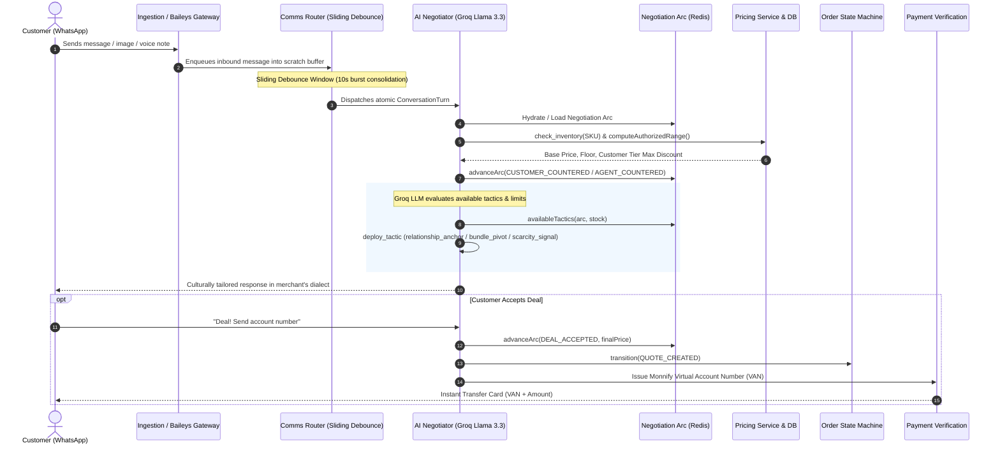

# ACE WhatsApp — Master Architecture Reference
> Internal context file. Updated as implementation progresses.
> Reconciles all service READMEs with actual code on disk.

---

## Service Inventory

| # | Service | Original README Stack | Current Implementation Stack | Status |
|---|---------|-----------------------|------------------------------|--------|
| 1 | `ingestion-service` | Rust + Actix-web | TypeScript + Fastify | ✅ Built & Active (Port 3000) |
| 2 | `identity-resolution` | Rust | TypeScript + PostgreSQL Links + GBI Hashing | ✅ Built & Active |
| 3 | `merchant-api` | TypeScript / REST | TypeScript + Fastify + JWT Auth + CORS | ✅ Built & Active (Port 3003) |
| 4 | `state-machine` | Rust | TypeScript Pure Functions (`orderStateMachine.ts`) | ✅ Built & Active (100% test coverage) |
| 5 | `payment-verification` | Rust | TypeScript + Fastify Webhook + Monnify/Paystack | ✅ Built & Active (Port 3002) |
| 6 | `catalog-sync` | TypeScript / Graph API | TypeScript + Fastify + Meta Graph API v21.0 | ✅ Built & Active (Port 3004) |
| 10 | `comms-router` | Rust | TypeScript + BullMQ Sliding Debounce + Outbound | ✅ Built & Active |
| 11 | `ai-negotiator` | Rust (rules) + Groq (agent) | TypeScript + Groq Llama 3.3 70B (5 tools, 4 tactics) | ✅ Built & Active |
| 12 | `baileys-gateway` | Node.js + Baileys v7 | TypeScript + Baileys v7 + Groq Vision + Whisper | ✅ Built & Active (Port 3005) |
| — | `data-intelligence` | Analytics Engine | TypeScript Singleton Sink + PostgreSQL + Telemetry | ✅ Built & Active |
| — | `shared` | Types & Clients | Shared Types, Postgres/Redis Clients, Auth, Telemetry | ✅ Built & Active |

---

## The Full Data Flow (Inbound Message → State Transition → Delivery)



---

## The Two Parallel State Machines

Two state machines run in parallel across every transaction lifecycle:

### 1. OrderStateMachine (`core/state-machine/src/orderStateMachine.ts`)
**What it tracks:** Pure transactional and fulfillment lifecycle facts.
```
no_order → draft → awaiting_payment → payment_verified → out_for_delivery → delivered
                                    ↘ cancelled (from draft, awaiting_payment)
```
- **Persisted in**: PostgreSQL `orders.state` (JSONB).
- **Core Guard**: `PAYMENT_CONFIRMED.amount === state.total` rejecting mismatched amounts.

### 2. NegotiationArc (`core/ai-negotiator/src/negotiationArc.ts`)
**What it tracks:** Strategic dialogue state and position within the multi-turn negotiation.
```
anchor → acknowledge → counter → close
                     ↘ pivot (bundle/credit) → escalate
                                             → abandoned
```
- **Persisted in**: Redis `arc:{merchantId}:{customerId}` with 24h TTL.
- **Dialect Persistence**: Stamped with merchant dialect and customer price counter-offers.
- **Elastic Traces**: Flushed to PostgreSQL `negotiation_traces` on deal completion or escalation.

---

## Key Autonomous Safeguards

1. **Deterministic Floor Enforcement**: LLM can never set prices below `pricingService.validateProposedPrice()` floor.
2. **Circuit Breaker Escalation**: Below-floor offers trigger `VendorCommuniqueEngine` dispatching 1/2/3 SMS / WhatsApp approval codes to merchant.
3. **Idempotent Deduplication**: Ingestion service deduplicates messages via Redis `SETNX` (24h TTL).
4. **Underpayment Protection**: Payment verification retains underpaid orders in `awaiting_payment` and prompts for the remaining balance.